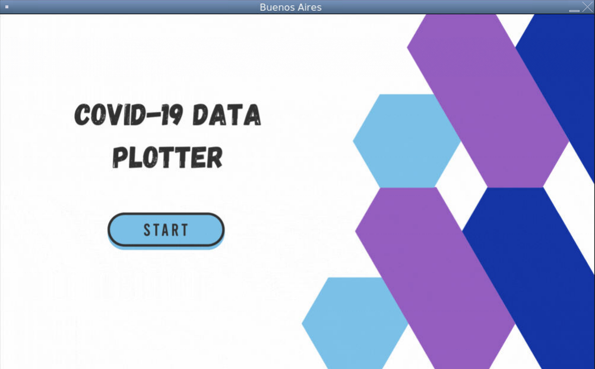

# COVID-19 Data Analysis and Visualization
##### Given COVID-19 data, will process, analyze, and plot, based on user input from a graphical user interface 
#

## USER MANUAL 
### Details of each file
#### preprocessing_optimized.py
* This file takes `data/raw_dataset1.csv` and aggregates the data into 3 files that each have the relavent data to the question being answered
* Only needs to be run once everytime `data/raw_dataset1.csv` is updated
#### gui.py
* This script runs the GUI instead so that the user dosen't need to use the shell
#### genderPercentage.py
* Answers the question:
> For the given PHU, which of the 4 genders has the highest percentage of confrimed COVID cases
* Requires a valid PHU as an input
#### ageRange.py
* Answers the question:
> For the given age range, which PHU has the highest total confirmed COVID cases 
* Requires a valid age range as an input
#### caseTrendInRange.py
* Answers the question:
> For the given time range, what is the general trend of all confirmed COVID cases in Ontario 
* Requires a time range `(YYYY-MM)` as an input
#### LTCHRatio.py
* Answers the question:
> What is the relationship between the average ongoing long term care homes (LTCH) COVID cases and the average new confirmed cases across Ontario
* Gets LTCH data from `data/raw_dataset2.csv`

### How to use the system:
* GUI 
    * For the first time when running: `python preprocessing_optimized.py data/raw_dataset1.csv` 
    * Script to start the GUI: `python gui.py`
    * Use the mouse as input in the GUI
    * All plots created are shown in the GUI and are also in the folder `plots`

## Contributers
* ##### Anthony Vidovic
* ##### John Denbutter
* ##### Or Brener
* ##### Tony Ngo
